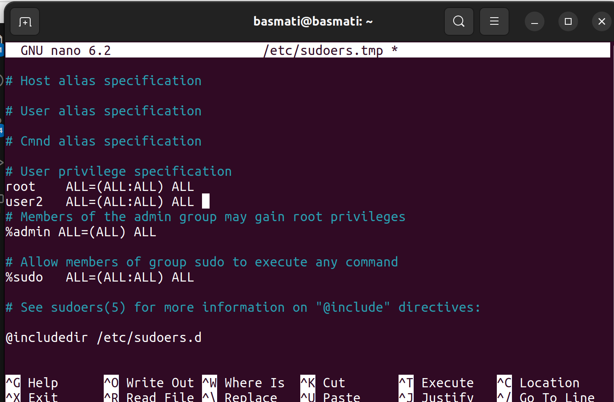

# Mistakes made

-   For the ease of logging in and out while working with `User2` in `Machine2`, we had added the user to the list of `sudoers`, which provided User2 with a superuser authority, which we definitely do not want when it comes to real-life scenarios.

    