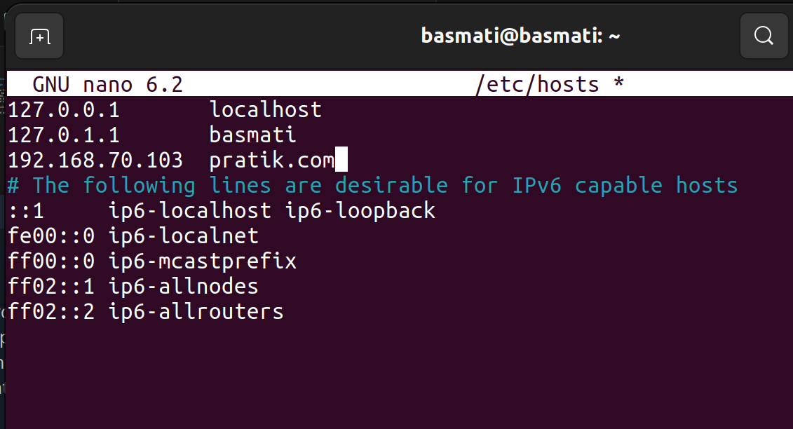

# Solution Contd

## Steps Followed

- Ensure `user2` exists on `Machine2`. If not, create the user as before.

- Access `Machine2` using a domain instead of the IP address. Edit the hosts file:

    ```
    sudo nano /etc/hosts
    ```

    Add `Machine2`'s IP address and assign a domain to it.
    
    
    
    *Image: Domain set-up*

- Follow the same SSH key verification process as before. As `User1` on `Machine1`, create an SSH key and copy the public key to `Machine2`. Ensure the public key is added to `user2`'s `authorized_keys` file on `Machine2`. Proper permissions must be set up.

    ```
    ssh user2@pratik.com
    ```

- Install `docker` on `User2` of `Machine2`:

    ```
    sudo apt-get install docker
    ```

- For fine-grained control over permissions, create a new group and add `user2` to it:

    ```
    sudo groupadd docker-users
    sudo usermod -aG docker-users user2
    ```

- Modify permissions of the Docker binary (`/usr/bin/docker`) so that only `user2` and members of the group (if created) can execute it:

    ```
    sudo chown root:docker-users /usr/bin/docker
    sudo chmod 750 /usr/bin/docker
    ```

- Add the following line to the sudoers file to grant access to `docker ps` only to `user2`:

    ```
    user2 ALL=(ALL) NOPASSWD: /usr/bin/docker ps
    ```

    
    
    *Image: Giving access of `docker ps` only to `user2`*

- Log in as `user2` and try running the `docker ps` command without using `sudo`. It should work without requiring a password.
