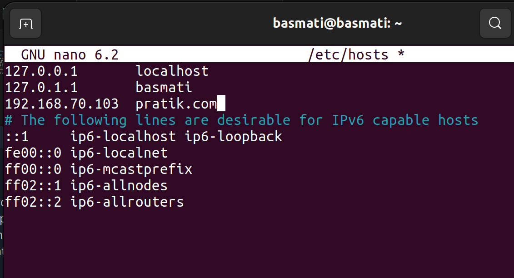

# Solution Contd

## Steps followed

-   Now that we have a connection between the first two machines. We should be logging into `Machine2` as `user2`. Make sure user2 exists in Machine2, if not, follow the process as before for user creation.
-   Now we need to acces Machine2 using a domain rather than the machine's IP, so we make changes as following
    
    `sudo nano /etc/hosts`

    and add Machine2's IP and provide a domain to it.
     

    *Image: Domain set-up*

-   We follow the same process of SSH key verification as before. As `User1` in `Machine1` you need to create an SSH-key and copy the public key to the final machine. Similarly, the public key should be present in `authorized_keys` of `Machine2`. After a proper hassle of permissions the access should be easy.

    `ssh user2@pratik.com`

-   Now we make restrictions so that only `User2` will be able to use the `docker ps` command. For this, we first install `docker` in `User2`.

    `sudo apt-get install docker` (in User2 of Machine2)

-   If you want to have fine-grained control over permissions, you can create a new group and add `user2` to it:

    `sudo groupadd docker-users`

     `sudo usermod -aG docker-users user2`

-   Modify the permissions of the Docker binary (`/usr/bin/docker`) so that only `user2` and members of the group (if created) can execute it

    `sudo chown root:docker-users /usr/bin/docker`
    
    `sudo chmod 750 /usr/bin/docker`
-   Add the following line to the sudoers file:

    `user2 ALL=(ALL) NOPASSWD: /usr/bin/docker ps`

    
    *Image= Giving access of `docker ps` only to `user2`*
-   Log in as `user2` and try running the `docker ps` command without using `sudo`. It should work without requiring a password.
